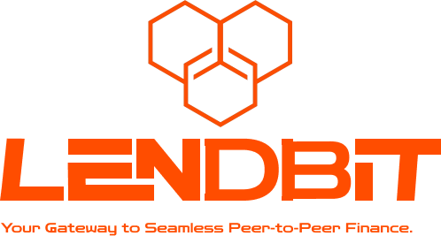

# Lendbit: Decentralized P2P Lending and Borrowing Platform

## Empowering Community-Driven Financial Solutions

Lendbit is a decentralized finance (DeFi) platform designed to revolutionize peer-to-peer lending and borrowing, enabling financial freedom and control through community-driven solutions. By leveraging blockchain technology, Lendbit ensures transparency, security, and efficiency in financial transactions.

### Key Features

- **Custom Loan Ads**: Lenders can create personalized loan offers, specifying terms such as interest rates, duration, and collateral types.
- **Flexible Borrowing**: Borrowers can explore loan offers, selecting the ones that best meet their financial needs.
- **Multi-Token Collateral**: Support for multiple tokens like **ETH**, **DAI**, and **USDC** as collateral.
- **Smart Collateral Management**: Automatic tracking of loan health with real-time monitoring and automated liquidation mechanisms.
- **Transparent & Fair**: Blockchain ensures all transactions and loan terms are verifiable and immutable.
- **Liquidation & Off-Chain Bots**: A seamless liquidation process backed by off-chain bots, ensuring loan security and instant repayment in case of collateral underperformance.

### Cross-Chain Lending with Hub-and-Spoke Architecture

Lendbit implements a **hub-and-spoke architecture** to enable cross-chain lending and borrowing. This approach allows Lendbit to operate seamlessly across multiple blockchain networks:

- **Centralized Hub**: The main hub resides on a central chain and handles core loan logic, interest accrual, and liquidation processes.
- **Spoke Chains**: Each supported blockchain (spoke) communicates with the hub, enabling borrowers and lenders to participate from any chain. Spoke chains allow localized transaction handling while the hub synchronizes loan terms and health across chains.
- **Interoperability**: With this architecture, users can lend or borrow assets across chains, enhancing liquidity and access while maintaining consistent loan management.

## How It Works

1. **Collateral Deposit**: Borrowers can deposit multiple tokens as collateral for loans.
2. **Real-time Valuation**: Lendbit integrates oracle services to provide up-to-date market prices, ensuring accurate collateral valuation.
3. **Loan Creation**: Lenders create customized loan offers or participate in lending pools with predefined terms.
4. **Borrower Selection**: Borrowers browse available offers and choose those that fit their needs.
5. **Smart Contract Execution**: After an agreement, the smart contract calculates the loan amount based on collateral and loan-to-value (LTV) ratio.
6. **Loan Disbursement**: Once the contract conditions are met, the borrower receives the loan in their desired token.

## Collateral Management

- **Multi-Token Support**: Borrowers can use assets like **ETH**, **DAI**, and **USDC** as collateral.
- **Accurate Valuation**: Real-time prices are retrieved from oracles to calculate total collateral value in USD.
- **LTV Ratio**: The system sets a loan-to-value (LTV) ratio, typically up to 80%, to determine the maximum loan amount.
- **Loan Monitoring**: Loans are actively monitored, and users can manage their collateral to maintain healthy loan conditions.

## Automated Liquidation & Off-Chain Bots

Lendbit's platform includes an automated liquidation process to safeguard lenders and ensure platform stability:

1. **Real-Time Loan Health Monitoring**: Loans are constantly evaluated based on collateral value and market fluctuations.
2. **Eligibility for Liquidation**: If a loan's health factor (collateral value vs. loan value) drops below a predefined threshold (usually < 1), it becomes eligible for liquidation.
3. **Off-Chain Liquidation Bots**: Off-chain bots instantly trigger the liquidation process, selling off collateral and repaying the lender to cover the outstanding loan balance.

This ensures seamless execution of liquidation without delays, maintaining the financial security of the platform.

## Why Choose Lendbit?

- **Community-Driven**: Users are empowered to set and control their own lending and borrowing terms.
- **Multi-Collateral Support**: Flexibility to use various cryptocurrencies as collateral.
- **Automated & Efficient**: Built-in smart contracts and off-chain bots streamline the collateral management and liquidation processes.
- **Transparent & Secure**: All transactions and loan details are recorded on-chain, providing transparency and reducing counterparty risk.

## Getting Started

Follow these steps to start using **Lendbit**:
1. Connect your wallet (MetaMask, WalletConnect, etc.) to the Lendbit platform.
2. Browse loan offers or create custom loan ads with your desired terms.
3. Deposit collateral (ETH, USDC) to secure your loan on any chain.
4. Once the loan terms are agreed upon, receive the loan in your chosen token and chain.

## Smart Contract Addresses

- **DiamondCutFacet deployed**: `0xDc0f9b15700989122D539aDc28b296Ee99ecaBF1`
- **Diamond deployed**: `0x05AE831342A66bA3640F5342eeBb50352fC6A4B0`
- **DiamondInit deployed**: `0xa976AB78E9518180eCbAbE49A1423ff9f1Dab170`

_Deploying facets_
- **DiamondLoupeFacet deployed**: `0x521a483e9DaE06E6757Fc910aC889BeAa84689Ae`
- **OwnershipFacet deployed**: `0x3787d54cb69e06db35DCE0A24f082c85f418b1b3`
- **ProtocolFacet deployed:** `0x4acF8370e30b17F40E1aD3AFee508A0bEa6b5Fb2`
- **XProtocolFacet deployed**: `0xB70Da2d2cF0f9d3cdfA2102a2989FfE33f7345E9`

## Contributing

We welcome and encourage contributions from developers and community members! If you're interested in contributing to Lendbit, please reach out via **X** [`@LendbitFinance`](https://x.com/LendbitFinance).
